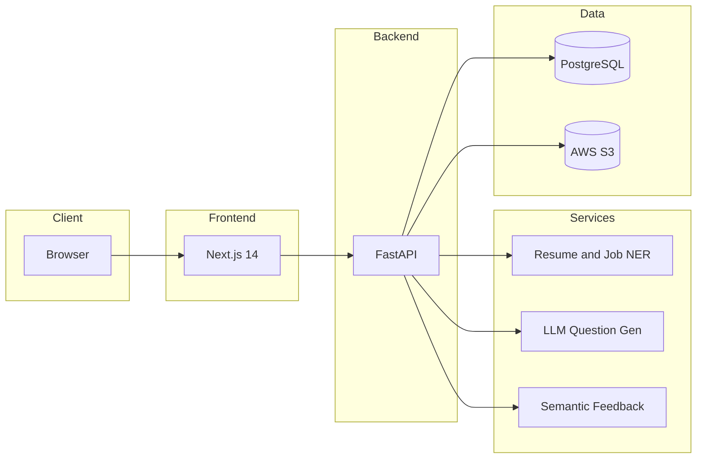
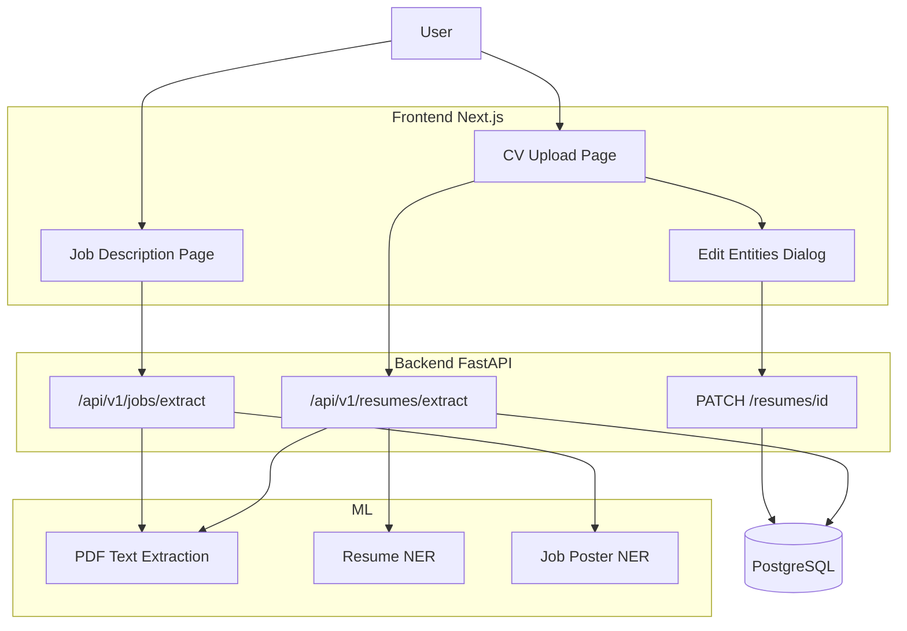

# IPD: Overall System Architecture, Wireframes & Updated Time Schedule

**Purpose:** Plan Phase 2 — material for the 10% (architecture) and 5% (time schedule) IPD criteria. Use in presentation slides.

---

## 1. High-level system architecture (target / PPRS)

**Caption for slide:** User → Next.js (UI) → FastAPI (API) → NER / LLM / Semantic modules → PostgreSQL & S3. (Current prototype implements NER + DB; LLM and Semantic are pending.)

---

## 2. Current prototype component diagram (IPD scope)

**Caption for slide:** Current IPD prototype: CV and Job pages call extract endpoints; PDF/text → extraction → NER → response; resume data persisted; edit via PATCH.

---

## 3. Wireframes (for slide "Overall system architecture / wireframes")

### 3.1 Upload résumé

- **Screen:** CV Upload page.
- **Elements:** Tabs: "Upload PDF" (file drop zone) | "Paste text" (textarea). Primary button: "Extract". After submit: loading state then "Extracted information" card with entity groups (Name, Email, Skills, Occupation, Education, Experience) and "Edit" button.
- **Location in app:** PROJECT `crackint-frontend/app/cv-upload/`, `components/cv-upload/CVUploadView.tsx`, `CVFileDropZone.tsx`, `CVPasteArea.tsx`.

### 3.2 View parsed entities (resume)

- **Screen:** Same page after extraction.
- **Elements:** Card showing labelled entity lists; "Edit" opens modal to change values per entity type; "Replace resume" returns to upload/paste.
- **Location:** `EditEntitiesDialog.tsx`, PATCH to backend.

### 3.3 Paste job / view job entities

- **Screen:** Job description page (to be added).
- **Elements:** Text area or PDF upload for job description; "Extract" button; result card with entities (e.g. Job title, Company, Skills required, Experience required, Education required).
- **Location:** New route and component calling `POST /api/v1/jobs/extract`.

### 3.4 Simple chat or Q&A (future)

- **Screen:** Not in IPD scope.
- **Planned:** Chat-style interface for questions and answers; semantic feedback area. Wireframe can be a single placeholder: "Question" area, "Your answer" input, "Feedback" area.

---

## 4. Updated time schedule (Gantt) and deviations

| Deliverable | Original (PPRS) | Updated / actual | Note |
|-------------|------------------|-------------------|------|
| Project proposal (drafts) | Sep–Oct 2025 | Sep–Oct 2025 | As planned. |
| Literature review | 10 Nov 2025 | 10 Nov 2025 | As planned. |
| SRS / PPRS final | 13 Nov 2025 | 13 Nov 2025 | As planned. |
| Proof of concept | 13 Nov 2025 | 13 Nov 2025 | As planned. |
| Design document | 20 Dec 2025 | 20 Dec 2025 | As planned. |
| **Prototype** | **2 Feb 2026** | **2 Feb 2026** | On track: resume + job extraction (FE+BE); NER integrated. |
| **IPD submission** | **2 Feb 2026** | **5 Feb 2026** | IPD deadline 05 Feb 2026 13:00 LK. |
| Implementation | 15 Mar 2026 | 15 Mar 2026 | Full implementation (QG, feedback, auth) planned. |
| Testing | 20 Mar 2026 | 20 Mar 2026 | As planned. |
| Evaluation | 25 Mar 2026 | 25 Mar 2026 | As planned. |
| Thesis submission / MVP | 1 Apr 2026 | 1 Apr 2026 | As planned. |

### Deviations and impact (for slide)

- **No major delays.** Resume NER and Job Poster NER training and integration took priority; prototype scope for IPD is resume + job extraction (no LLM/semantic feedback yet) to ensure a stable, demonstrable build by the deadline.
- **IPD deadline:** Official submission 05 Feb 2026 13:00 LK (Blackboard + Google Form). Prototype and demo videos to be ready by then.
- **Impact:** Prototype demonstrates core NER pipeline and integrated FE+BE; question generation and semantic feedback are clearly scoped for post-IPD (March–April) and reflected in "implemented vs pending" ([requirements-implemented-vs-pending.md](requirements-implemented-vs-pending.md)).

---

*Use Section 1–2 in "Overall system architecture", Section 3 in "wireframes", and Section 4 in "Updated time schedule" slides.*
