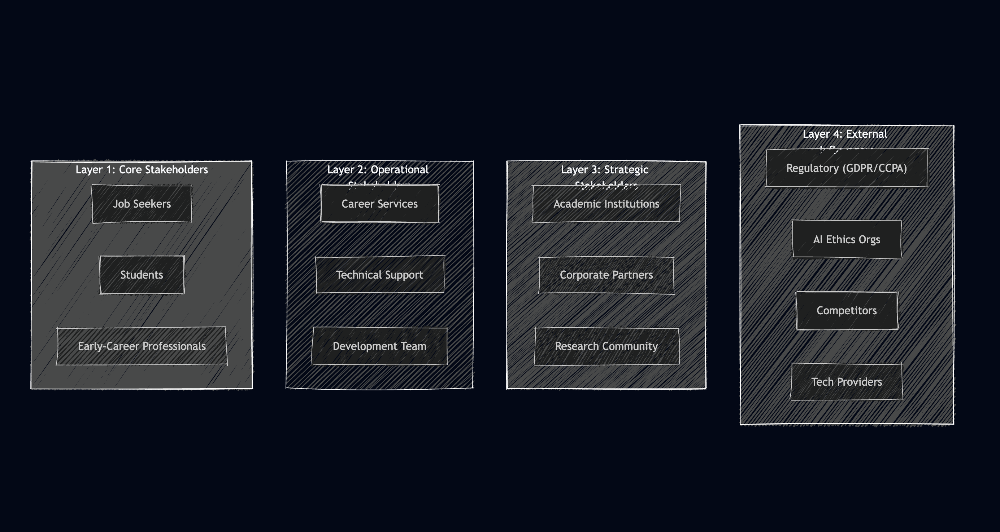

# Chapter 05: Social, Legal, Ethical and Professional Issues (SLEP)

**Purpose:** Address Social, Legal, Ethical and Professional issues specific to CrackInt. Aligns with BCS Code of Conduct. For IPD thesis Chapter 5.

---

## 5.1 Chapter Overview

This chapter identifies and mitigates Social, Legal, Ethical and Professional (SLEP) issues arising from the design and deployment of CrackInt, an AI-driven interview preparation platform. The system processes sensitive personal data (résumés, practice responses), uses AI for entity extraction and semantic evaluation, and serves job seekers who may experience anxiety and vulnerability. Adherence to the BCS Code of Conduct (British Computer Society) is maintained throughout, and each issue is addressed with specific mitigation strategies.

### 5.1.1 Stakeholder Context

Figure 1 shows the Stakeholder Onion Model (from Chapter 4, SRS), which identifies stakeholders across four layers: Core (job seekers, students, early-career professionals), Operational (career services, technical support, development team), Strategic (academic institutions, corporate partners, research community), and External (regulatory bodies, AI ethics organisations, competitors, technology providers). SLEP considerations apply across all layers.

*Figure 1: Stakeholder Onion Diagram — CrackInt stakeholders by layer*

---

## 5.2 SLEP Issues and Mitigation

### 5.2.1 Summary Table (2×2)

| | **Social** | **Legal** |
|---|---|---|
| **Ethical** | **Social–Ethical:** Job seekers may feel judged or discouraged by AI feedback. Anxious candidates need a supportive, non-punitive practice environment. **Mitigation:** Design feedback to be constructive (“growth areas” not “failures”); use encouraging tone; avoid harsh or demotivating language. User testing to validate tone. | **Legal–Ethical:** Handling PII (résumés, emails, names) requires lawful processing. **Mitigation:** Implement GDPR/CCPA-compliant consent, data minimisation, right to erasure; anonymise data used for model training or research; transparent privacy policy. |
| **Professional** | **Social–Professional:** Career services and recruiters rely on accurate NER and feedback. Misleading extraction could harm candidate profiles. **Mitigation:** Allow manual review and edit of extracted entities (FR05); document model limitations; provide fallbacks when AI fails. | **Legal–Professional:** Compliance with data protection and employment law. **Mitigation:** Secure storage (AES-256 at rest); encrypted transmission (HTTPS); session expiry; audit logs; no sharing of résumé data with employers without explicit consent. |

---

### 5.2.2 Detailed SLEP Analysis

#### Social Issues

| Issue | Description | Mitigation |
|-------|-------------|------------|
| **Interview anxiety** | Candidates preparing for interviews often experience stress. Harsh or overly critical AI feedback could increase anxiety and reduce confidence. | Feedback designed to be constructive; positive framing; “areas for improvement” instead of “weaknesses.” |
| **Digital divide** | Candidates without reliable internet or modern devices may be excluded. | Mobile-responsive design (NFR09); support for low-bandwidth scenarios; optional offline modes in future. |
| **Bias in AI** | NER or semantic feedback may inadvertently reflect biases from training data (e.g. privileging certain industries or naming conventions). | Diversified training data; regular bias audits; supervisor approval for model choices; transparency in limitations. |

#### Legal Issues

| Issue | Description | Mitigation |
|-------|-------------|------------|
| **GDPR compliance** | EU users’ data must be processed lawfully, with consent, purpose limitation, and rights to access, rectification, and erasure. | Consent at registration; right to delete account and data; data portability; privacy policy; session retention limits. |
| **CCPA compliance** | California users have rights to know, delete, and opt out of sale of personal information. | No sale of data; opt-out mechanisms; disclosure of data use. |
| **Data retention** | Storing résumés and practice transcripts long-term increases risk and obligation. | Configurable retention; auto-deletion after defined period; minimal storage of raw text where possible. |

#### Ethical Issues

| Issue | Description | Mitigation |
|-------|-------------|------------|
| **Transparency** | Users must understand how AI is used and what it can/cannot do. | Clear documentation; explain that feedback is AI-generated; disclaimer on accuracy. |
| **Fairness** | AI should not disadvantage candidates from underrepresented groups. | Bias monitoring; diverse training data; avoid invasive proctoring (no facial/keystroke analysis). |
| **Informed consent** | Users should consent to data processing with full understanding. | Explicit consent at upload; clear privacy policy; no pre-ticked consent boxes. |

#### Professional Issues

| Issue | Description | Mitigation |
|-------|-------------|------------|
| **BCS Code of Conduct** | Practitioners must act in the public interest, with integrity, and uphold professional standards. | Adherence to BCS principles: public interest, professional competence, duty to employers/clients, professional integrity. |
| **Accuracy and reliability** | Incorrect NER or feedback could mislead candidates. | Allow manual correction; document model accuracy (F1, precision, recall); fallback when model unavailable. |
| **Accountability** | Clear ownership for system behaviour and data handling. | Logging; error tracking; documented architecture; version control. |

---

## 5.3 BCS Code of Conduct

The BCS Code of Conduct (BCS, n.d.) requires members to:

1. **Act in the public interest** – CrackInt serves job seekers by democratising access to interview preparation; we avoid harmful or discriminatory outcomes.
2. **Act with integrity** – We do not misrepresent AI capabilities; we document limitations and allow human override.
3. **Maintain professional competence** – We use established frameworks (FastAPI, Next.js, PyTorch) and follow best practices for security and data protection.
4. **Be accountable** – We maintain logs, version control, and documentation for audit and improvement.

*Reference: BCS Code of Conduct. Available at: https://www.bcs.org/membership-and-registrations/bcs-code-of-conduct/*

---

## 5.4 Consent and Data Handling

- **Interview/survey participants:** Written consent obtained; names omitted unless explicitly permitted.
- **Resume upload:** Users consent at upload; privacy policy explains storage, processing, and retention.
- **Model training:** Data used for training (if any) is anonymised; no PII retained in model weights.

---

## 5.5 Chapter Summary

This chapter addressed Social, Legal, Ethical and Professional issues relevant to CrackInt. Key mitigations include: constructive feedback design, GDPR/CCPA compliance, transparency about AI limitations, manual correction of extracted entities, and adherence to the BCS Code of Conduct. Ongoing monitoring and user feedback will inform further refinements to SLEP practices.
