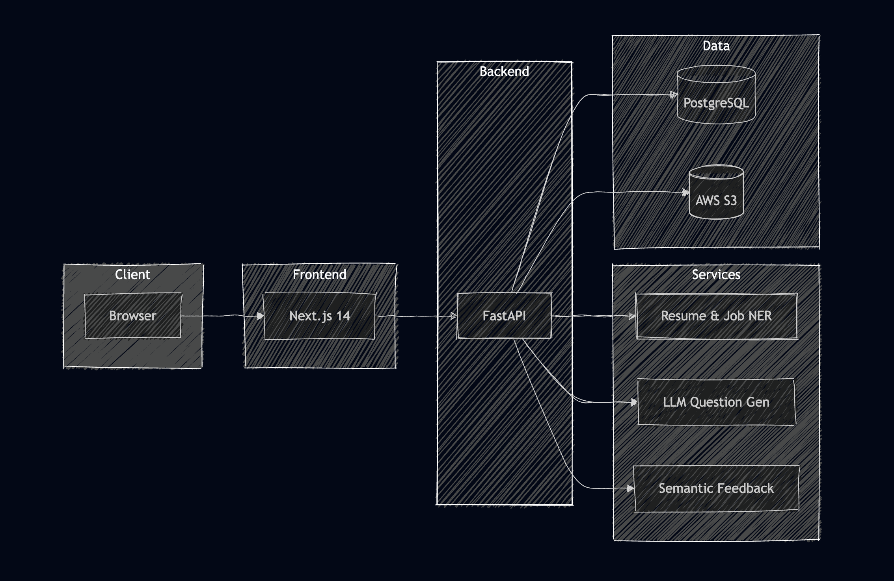
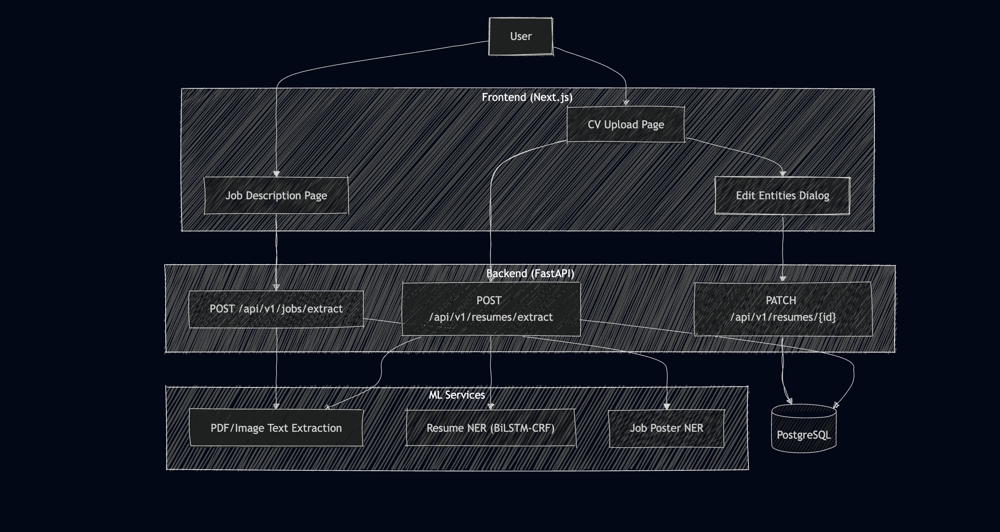
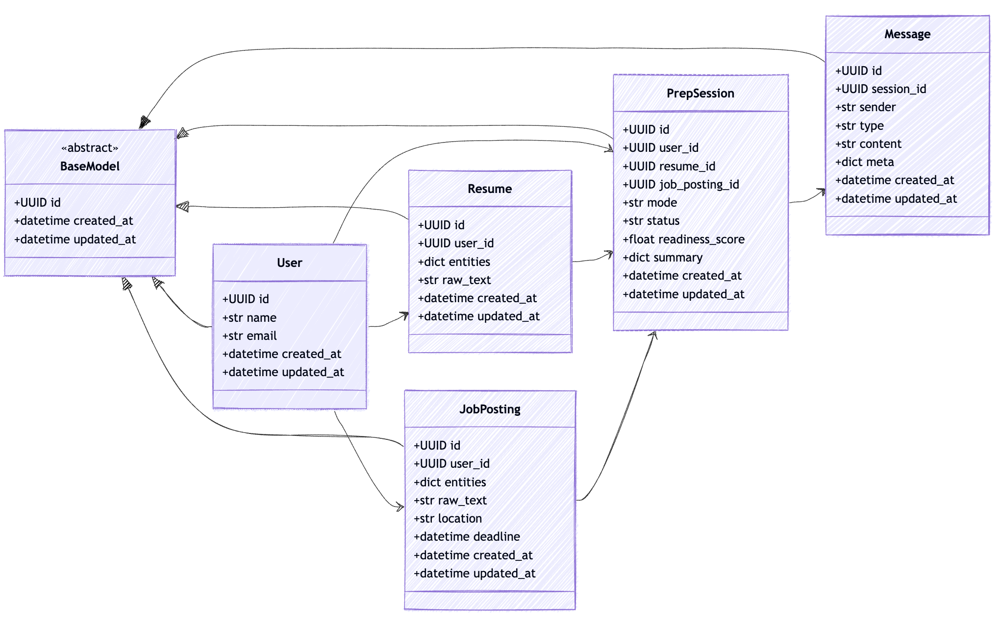
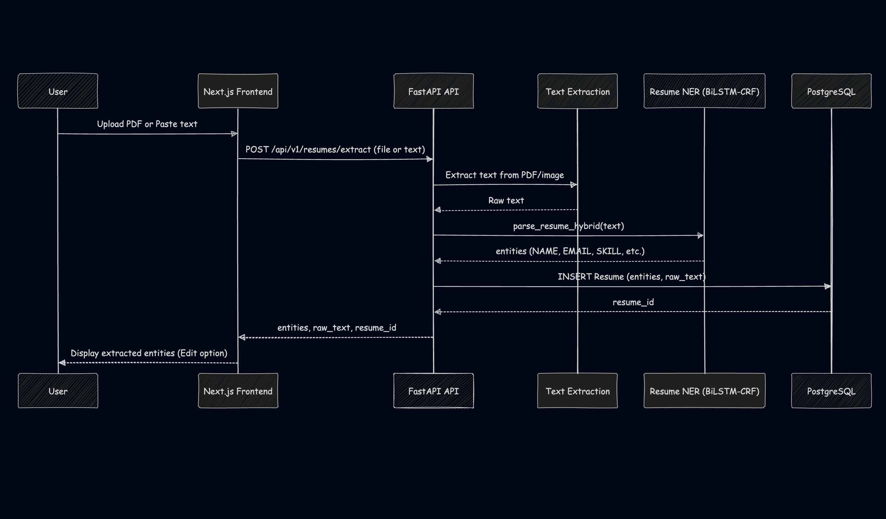
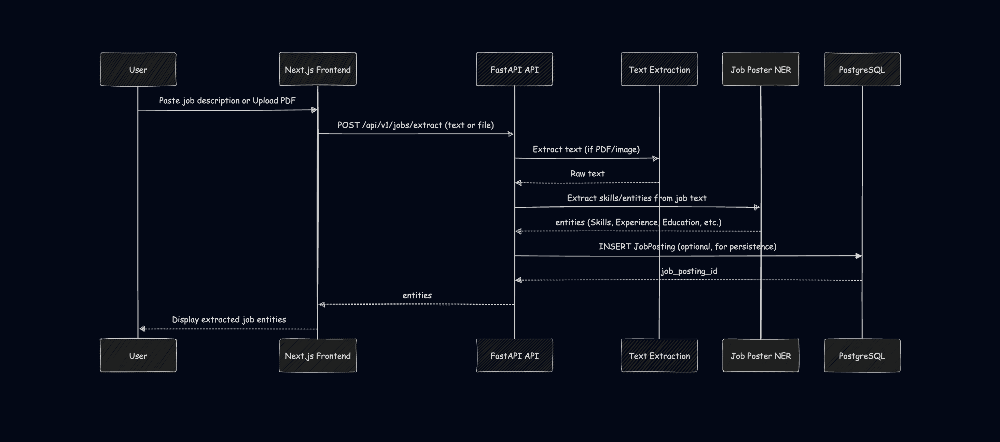
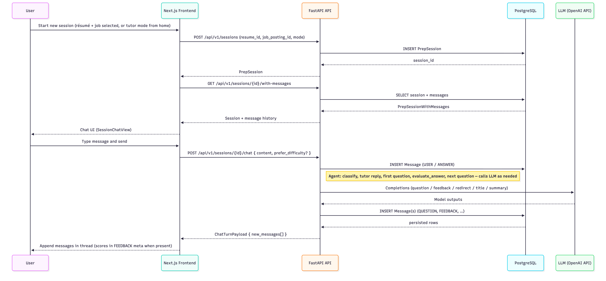
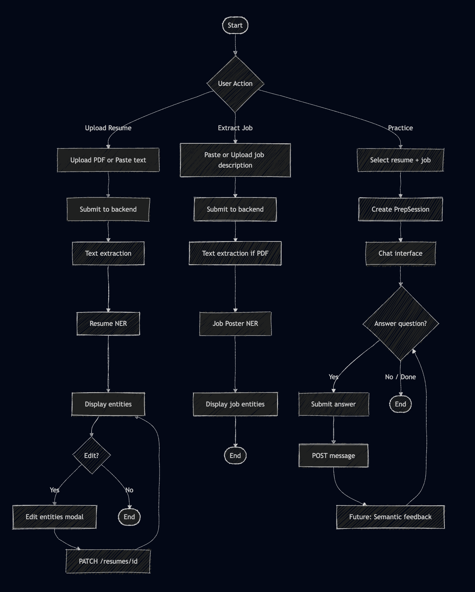
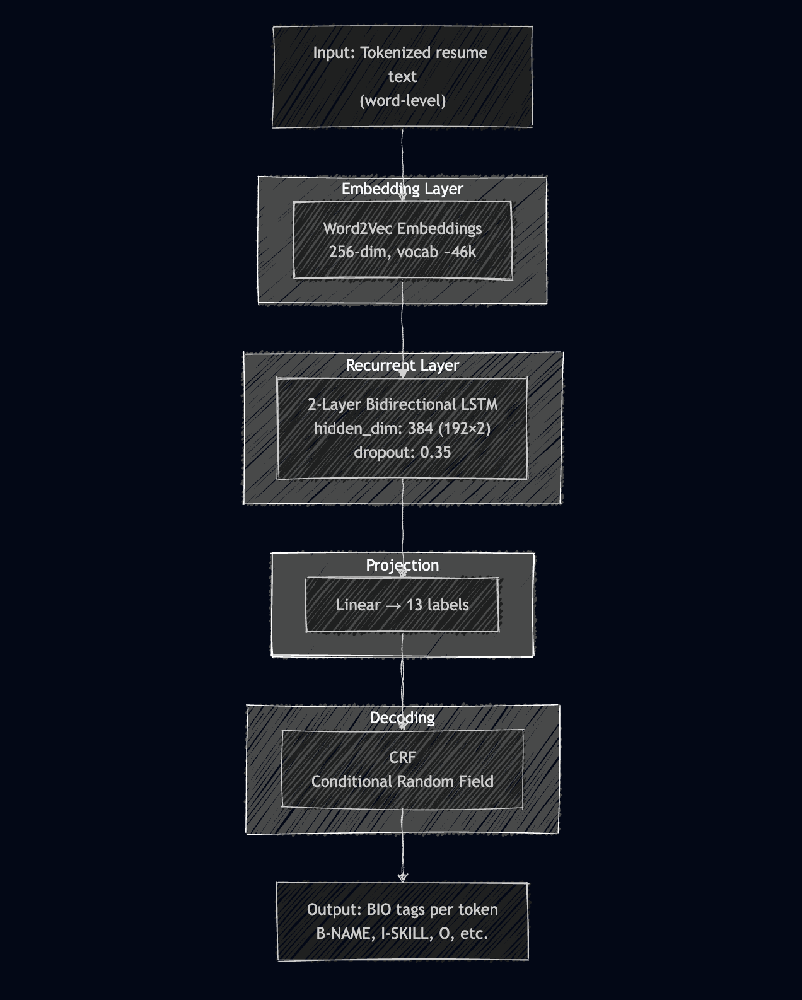

# Chapter 06: Design

**Purpose:** Design chapter for IPD thesis. Covers design goals, system architecture, detailed design, algorithm/neural network design, and UI wireframes.

---

## 6.1 Chapter Overview

This chapter describes the design of CrackInt, from high-level system architecture to detailed component design. It links design goals to the non-functional requirements from the SRS, presents the tiered architecture of the prototype, details the BiLSTM-CRF NER model architecture, and includes low-fidelity wireframes for key user interfaces.

---

## 6.2 Design Goals

Design goals are derived from NFRs and define quality attributes maintained system-wide:

| Goal | Source NFR | Rationale |
|------|------------|-----------|
| **Performance** | NFR02, NFR03, NFR04 | Résumé parsing ≤10s; question generation ≤15s; semantic feedback ≤5s. |
| **Usability** | NFR09, NFR10 | Mobile-responsive (320px–2560px); intuitive navigation; fast page load. |
| **Accuracy** | FR04, FR11 | NER extraction and semantic evaluation must meet acceptable precision/recall. |
| **Security** | NFR01, NFR14–NFR16 | Encrypted storage, secure transmission, GDPR-compliant handling of PII. |
| **Maintainability** | NFR13 | Modular frontend/backend separation; OpenAPI documentation; clear code structure. |
| **Reliability** | NFR08 | Zero data loss; auto-save; fallback when AI services fail. |

---

## 6.3 System Architecture Diagram

### 6.3.1 High-Level Architecture (Target)

*Figure 2: High-Level System Architecture*

**Tiers:**
1. **Client:** Browser (Chrome, Firefox, Safari, Edge; mobile and desktop).
2. **Frontend:** Next.js 14 app (App Router), Tailwind CSS, shadcn/ui.
3. **Backend:** FastAPI with API routes, ML services (NER), and DB access.
4. **Data:** PostgreSQL (users, resumes, job postings, prep sessions, messages).

### 6.3.2 Current Prototype Component Diagram (IPD Scope)

*Figure 3: Prototype Component Diagram — IPD scope*

---

## 6.4 Detailed Design

### 6.4.1 Backend Module Structure (OOAD)

| Module | Responsibility | Key Classes/Components |
|--------|----------------|------------------------|
| **api/** | HTTP routes, request/response handling | `router.py`, `resume/route.py`, `job/route.py`, `session/route.py` |
| **ml/** | NER models, inference | `resume_ner.py`, `job_poster_ner.py` |
| **services/** | Text extraction, OCR | `text_extraction.py`, `ocr.py` |
| **models/** | SQLModel/ORM entities | `User`, `Resume`, `JobPosting`, `PrepSession`, `Message` |
| **config/** | Settings, env vars | `config.py` |

### 6.4.2 Frontend Module Structure

| Module | Responsibility | Key Components |
|--------|----------------|----------------|
| **app/** | Pages (App Router) | `cv-upload/`, `job-upload/`, `job-postings/`, `sessions/` |
| **components/** | Reusable UI | `cv-upload/CVUploadView`, `EditEntitiesDialog`, `SessionChatView` |
| **services/** | API clients | `resume-uploader.service.ts`, `sessions.service.ts`, `job-postings.service.ts` |
| **lib/** | Utilities | `utils.ts` |

### 6.4.3 Database Schema (Key Entities)

- **User:** id, name, email, created_at, updated_at  
- **Resume:** id, user_id, entities (JSONB), raw_text, created_at, updated_at  
- **JobPosting:** id, user_id, entities (JSONB), raw_text, location, deadline, …  
- **PrepSession:** id, user_id, resume_id, job_posting_id, mode, status, readiness_score, summary (JSONB)  
- **Message:** id, session_id, sender, type, content, meta (JSONB)

### 6.4.4 Backend Class Diagram

*Figure 4: Backend Class Diagram — Key entities and relationships*

### 6.4.5 Sequence Diagrams

**Resume Extract Flow**

*Figure 5: Sequence diagram — Resume extraction*

**Job Extract Flow**

*Figure 6: Sequence diagram — Job extraction*

**Session/Chat Flow**

*Figure 7: Sequence diagram — Session and chat flow*

### 6.4.6 Activity Diagram — Main User Flow

*Figure 8: Activity diagram — Main user flows (CV upload, job upload, sessions)*

---

## 6.5 Algorithm Design: BiLSTM-CRF for Resume NER

### 6.5.1 Model Architecture

The final Resume NER model is **Word2Vec + BiLSTM + CRF** (Path 2), achieving Test F1 ≈ 0.79.

*Figure 9: BiLSTM-CRF Architecture — Resume NER model*

### 6.5.2 Entity Types and BIO Tags

| Entity | B-Tag | I-Tag | Example |
|--------|-------|-------|---------|
| NAME | B-NAME | I-NAME | John Doe |
| EMAIL | B-EMAIL | I-EMAIL | john@example.com |
| SKILL | B-SKILL | I-SKILL | Python, Machine Learning |
| OCCUPATION | B-OCCUPATION | I-OCCUPATION | Software Engineer |
| EDUCATION | B-EDUCATION | I-EDUCATION | BSc Computer Science, University of Colombo |
| EXPERIENCE | B-EXPERIENCE | I-EXPERIENCE | Virtusa, WSO2 |

### 6.5.3 Hybrid Extraction Strategy (Production)

1. **NAME:** Heuristic (first non-email line, 1–4 capitalized words).  
2. **EMAIL:** Regex extraction.  
3. **SKILL, OCCUPATION, EDUCATION, EXPERIENCE:** BiLSTM-CRF model.  
4. **Post-processing:** Normalize, deduplicate, strip trailing punctuation.

---

## 6.6 UI Design (Wireframes)

### 6.6.1 CV Upload Page

**Elements:**
- Tabs: "Upload PDF" | "Paste text"
- File drop zone (PDF, PNG, JPEG, WebP)
- Textarea for paste
- Primary button: "Extract"
- Loading state during extraction
- Result card: entity groups (Name, Email, Skills, Occupation, Education, Experience)
- "Edit" button → opens Edit Entities modal
- "Replace resume" → return to upload/paste

**Location:** `crackint-frontend/app/cv-upload/page.tsx`, `components/cv-upload/CVUploadView.tsx`

### 6.6.2 Edit Entities Dialog

**Elements:**
- Modal with labelled inputs per entity type (NAME, EMAIL, SKILL, etc.)
- Add/remove items (e.g. multiple skills)
- "Save" → PATCH `/api/v1/resumes/{id}`
- "Cancel" → close without saving

**Location:** `components/cv-upload/EditEntitiesDialog.tsx`

### 6.6.3 Job Description Page

**Elements:**
- Text area or file upload for job description
- "Extract" button → POST `/api/v1/jobs/extract`
- Result card: Job title, Company, Skills required, Experience required, Education required

**Location:** `crackint-frontend/app/job-upload/page.tsx`, `components/job-upload/JobUploadView.tsx`

### 6.6.4 Sessions / Chat (Placeholder for UC-04)

**Elements (planned):**
- List of prep sessions
- Chat interface: question area, answer input, feedback area
- Semantic feedback display (score, strengths, improvements)

**Location:** `crackint-frontend/app/sessions/`, `components/sessions/SessionChatView.tsx`

### 6.6.5 Design Considerations

- **Usability:** Clear labels, consistent spacing, accessible contrast.  
- **Accessibility:** Keyboard navigation, sufficient colour contrast, semantic HTML.  
- **Mobile:** Responsive layout for 320px–2560px viewports.

---

## 6.7 Chapter Summary

This chapter presented the design of CrackInt: design goals aligned with NFRs, high-level and prototype system architecture, backend/frontend module structure, database schema, BiLSTM-CRF NER algorithm design, and low-fidelity UI wireframes for CV upload, edit entities, job extraction, and sessions. The design supports the IPD prototype scope (resume + job NER) and prepares for future phases (question generation, semantic feedback, analytics).
